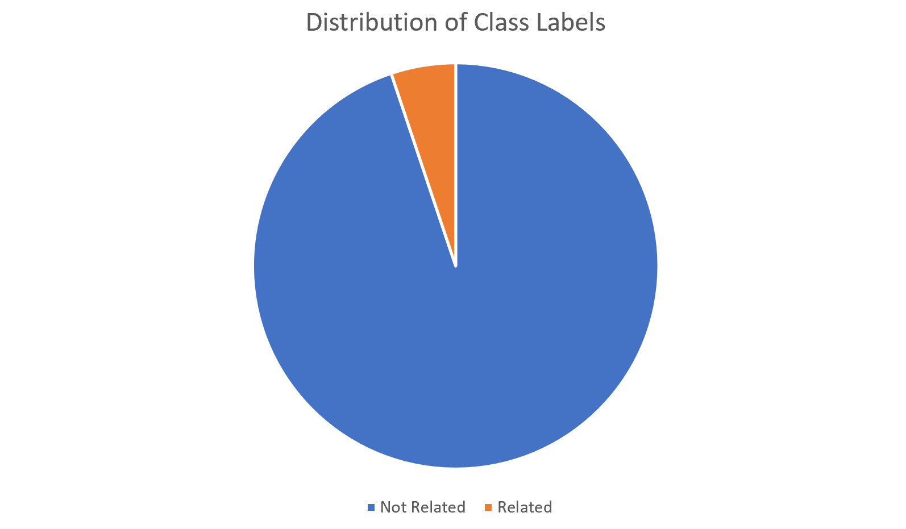
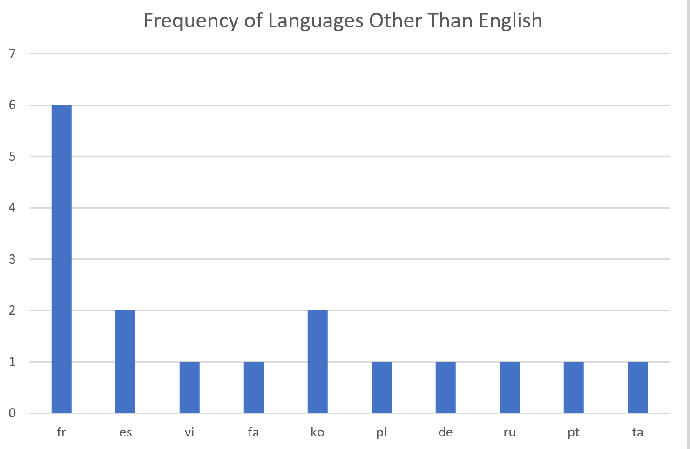
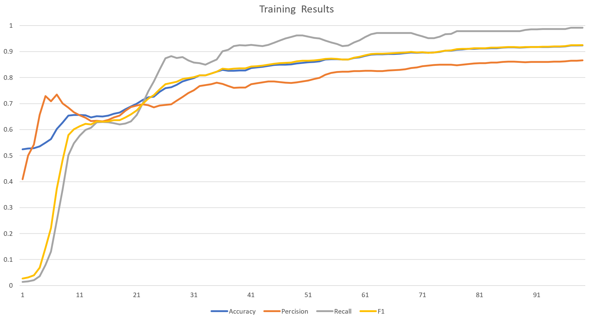

# News Relevancy Detection Task | Exploration Doc
    The document at hand, represents all the steps performed
    to analize the given dataset and results that leaded to the creation of a prediction model.

### Table of Contents
- [Data Exploration](#data-exploration)
- [Data Manipulation](#data-manipulation)
- [Model Exploration](#model-exploration)
- [Future Work](#future-work)
- [References](#references)
- [Author Info](#author-info)
---

## Data Exploration

    In order to be able to explore the dataset faster and better, it was initially loaded into a Sqlite database using `initial_db_load` .
    Checking labels' frequencies was the first step perfomed, that yeilded that the dataset is highly imbalanced and this fact should be taken care of before jumping into model selection and training.

    
    Nextly, other features of the dataset were explored one by one.
    `Title` that comes in String format looks like one of the main features we will be using as our input, as many experts indicate that the title of a news can be a good representative of the whole news concept and can reflect its relevancy to a certain subject.
    `URL`, that is the link to the corresponding news is not going to be a feature of the predictive model, but it shall be used to extract more data of the news. checking out the different URLs, it came into light that given different domains and websites it would not be easy to develop a general scraping solution that can extract the news or its snippet from the given URL. Instead, it can be used to query Google by its domain and extract the snippet from that. For example : searching the below query on Google can result in the title of the news and a short snippet.
    `site:domain title`
    Although this method sounds promising, but there are serious limitations with it, for example Google servers block similar queries made in short time interval after a few requests.
    `Author` field also can be used to apply different filters on the data. A set of queries were made on `Author` to see if the are any authors that have only published news that are not relevant. Furthermore, it is possible to perform a `whois` request on each domain and add the domain owner to the dataset, to further check if there is any simillarity between domain owners that might be mainstreaming in the field of real estate. Given the time limits for this task, this step was skipped as future work.
    `Snippet` can also be a main feature for our modelm but as indicated in the task document only `Title` and `URL` will be given to test the model, with that in mind along the drawbacks of scarping the snippet from the URL, we might skip this feature as well.
    Moreover a `langdetect` was performed on the text features to check the language of the written text. this can further be used to decide on the model wheather to be a multilingual or not.

## Data Manipulation

    First step of data manipulation is to balance the data.
    Given the high difference between the classes, Undersampling or Oversampling alone can not be used to balance the dataset.
    In order to handle that a hybrid of both were applied. The first step was to remove the records where its author only had published news with the `Related` label as `0` , assuming that the present dataset covers enough ground truth for real estate related news. This step reduces the number of records of label `0` by 6000, but it is still not enough as the dataset remains imbalanced. Nextly, an NLP-based oversampling was performed on the `Title` field. For each record with label set to `1`, a random number of simmilar records were generated with their words replaced by their synonyms. The above process is avaiable at `oversampling.py` in the current directory.

    Moreover, to prepare the data for our model exploration, a series of NLP operations were performed on the text data. First, all the stop words and puncuations were removed from the text. Then, the text got tokenized and stemmed afterwards. The above process is available at `data_prep.py` in the current directory.

## Model Exploration

    Simplest approach to this task would be to manually tokenize the texts, then using a traditional TF-IDF alter it to an embedding and lasty use non complex classifiers like Naive Bayes, SVM and so on. This approach was discarded knowing that it is ill-posed in regard of scalability and productionization.
    Not wanting to reinvent the wheel, model exploration was then followed by exploring pretrained models. Transofmer models like XLNet and T5 were guessed to give the best perforemance for this task, whilst having all the necessary factors to become a product. But sadly, they require proper GPU with enough cache to be fine tuned on the dataset, although after training and saving weights it can be integrated on a server with low processing power. The boilerplate code for utilization of XLNet is provided in the solution, but never ran and tested.

    The last decision was to use a light weight pretrained CNN from `SpaCy`. SpaCy is the most industrial NLP tool avaiable in the market today, and scalability makes it a good choice. `spaCy_txt.py` contains all the exploratory steps performed using spaCy. The results ended to converge in 100 iterations with a competetive performance.
    Accuracy, Percision, Recal and F1 were used to evaluate the model.

---

## Future Work

    There is a lot room for improvement for this task. From data augmentation and scraping much more data, to creating an ensemble model consisting of different fine-tuned pretrained transformer models.
[Back To The Top](#read-me-template)

---

## References
- [SpaCy](https://spacy.io/)

- [NLTK](https://www.nltk.org/)

- [Langdetect](https://pypi.org/project/langdetect/)
[Back To The Top](#read-me-template)

---

## Author Info
The News Relevancy Detection Task was perfomed as partial to the fullfillment of interview process of RoomVU Ltd. by Parmànn M. Alizadeh.

- Email - [Parmànn M. Alizadeh](prmma23@gmail.com)
- LinkedIn - [@prmma23](https://www.linkedin.com/in/prmma23/)

[Back To The Top](#read-me-template)